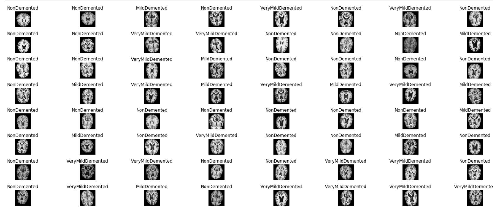
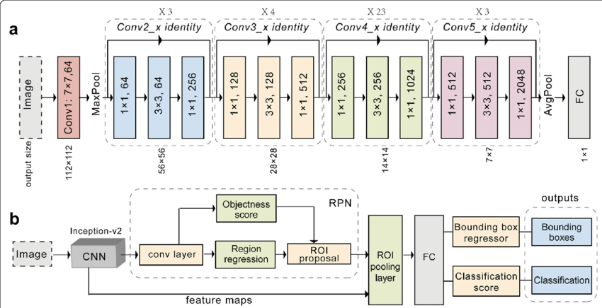
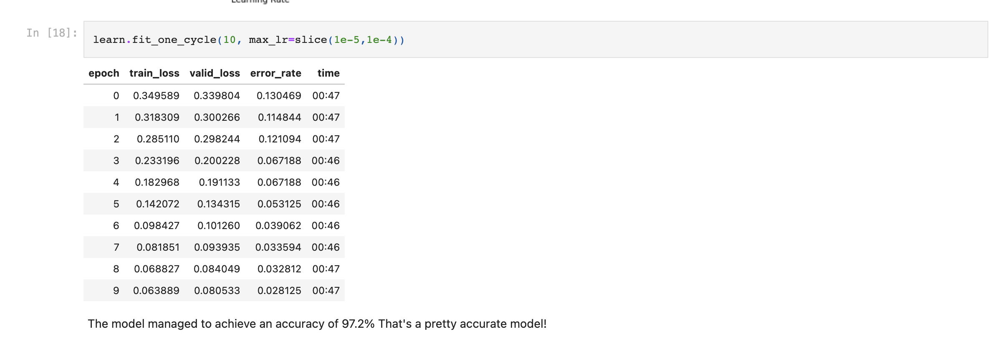
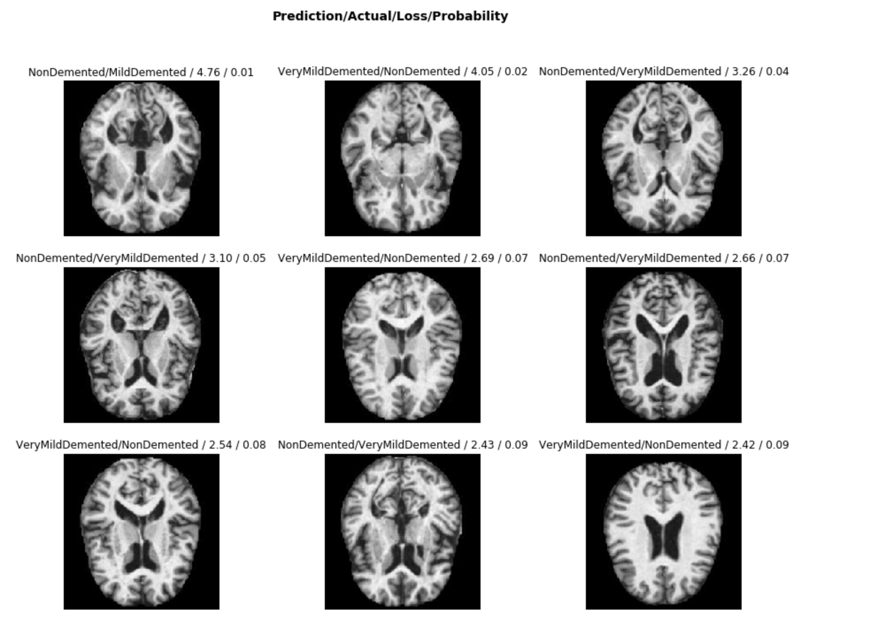
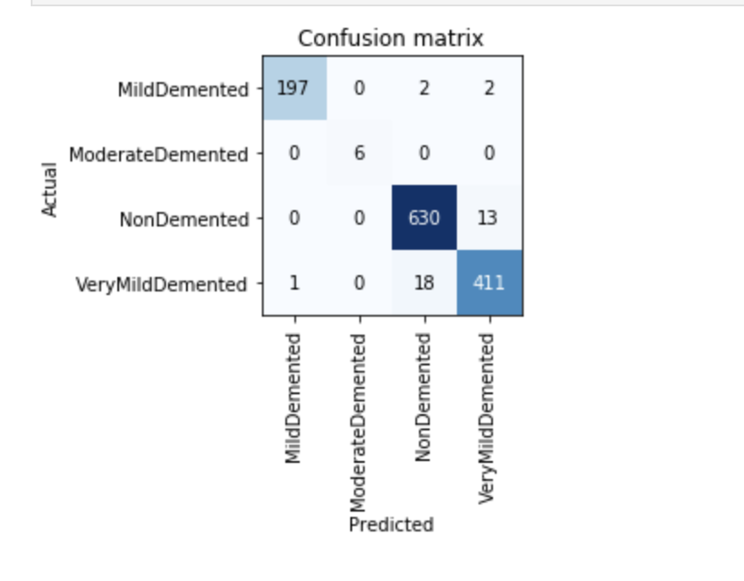

## Aim
The aim of this project is to create an accurate model that is able to predict 4 stages of Alzheimers using a [neuroimaging dataset](https://www.kaggle.com/tourist55/alzheimers-dataset-4-class-of-images/data) acquired from Kaggle.

## Problem

Alzheimer’s disease (AD) is an irreversible, progressive brain disorder marked by cognitive decline with no validated cure [(De Strooper & Karran, 2016)](https://www.ncbi.nlm.nih.gov/pubmed/26871627). Hence, a great deal of effort has been made by the scientific community to detect it early to slow or prevent disease progression [(Galvin, 2017)](https://www.ncbi.nlm.nih.gov/pubmed/28766695). Advanced neuroimaging techniques such as magnetic resonance imaging (MRI) have been developed to identify structural and molecular biomarkers [(Veitch et al., 2019)](https://www.ncbi.nlm.nih.gov/pubmed/30321505). Nonetheless, analysis of large-scale neuroimaging data sets can be time-consuming requiring specialists to manually look for features in images that represent at a stage in disease progression.

## Summary of Strategy

Stages in Alzheimer's can be predicted by CNNS using MRI imaging data. Knowing this, I acquired a +5000 MRI image dataset with an Open Database License (ODBL) from Kaggle, which contained 4 classes of images representing 4 stages of Alzheimer's progression: Non-Demented, Very Mildly Demented, Mildly Demented and Moderately Demented.

After that I trained, the CNN based on the 4 image classes. I initially got a **prediction accuracy of 75%** using ResNet50 (CNN model with 50 layers deep) without optimising the model. To improve the accuracy, I tried a different CNN model called ResNet101, which has been trained on more than a million images from the ImageNet Database, has 101 layers and can classify images into 1000 object categories. I also improved the accuracy by training the model multiple times with various parameters to find the optimal parameters. By doing so, I managed to increase the **prediction accuracy to 97.2%**

## Dataset

The dataset had 4 classes: 'MildDemented', 'ModerateDemented', 'NonDemented', 'VeryMildDemented'

## Training the Model

The model used was a pre-trained resnet 101 CNN. Below is a screenshot of the architecture of the model: 

Below is a screenshot of the training process

## Results

Let's see what results we have got.

We will first see which were the categories that the model most confused with one another. We will try to see if what the model predicted was reasonable or not. In this case the mistakes look reasonable (none of the mistakes seems obviously naive). This is an indicator that our classifier is working correctly.

Furthermore, when we plot the confusion matrix, we can see that the distribution is heavily skewed: the model makes the same mistakes over and over again but it rarely confuses other categories. This suggests that it just finds it difficult to distinguish some specific categories between each other; this is normal behaviour.

## Conclusion

This model has produced a state-of-the art accuracy on this dataset as of January 2020, proving that they may be some potential in the usefulness of this model in industry. Future work would involve using larger datasets and potentially building applications that would enable the CNN models to make predictions at a larger scale.